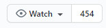

# First Day

## Subscribe to Handbook Changes

Go to the [Handbook](https://github.com/distancify/handbook) (you're probably already here). Make sure you have a GitHub account, and make sure you **Watch** this repository for future updates.

## Calendar Sharing

Always make sure your collegues can access and look at your calendar. This will make it easier to schedule meetings but also figure out where you are if you happen to not be around. Since we are a distributed company we don't see each other. But your calendar tells us where you are.

This of course means that you need to keep your calendar up to date. If you're going out of office, even if it's a personal errand, block out the time in your calendar.

In order to give your collegues access to see your calendar, [follow this guide](https://support.office.com/en-us/article/share-an-outlook-calendar-with-other-people-353ed2c1-3ec5-449d-8c73-6931a0adab88). If you feel your integrity being invaded, it's fine to only give your collegues the right to see title and locations.

## Absence.io

We use Absence.io to manage all vacation and leave. After you receive your invitation via e-mail, log in and access your **Profile > Integrations** and enable Office 365 integration. This will automatically put any planned leave in Absence in your Outlook calendar, so your colleagues can see when you're available when scheduling meetings.

Note that the data in Absence.io is also used to calculate your pay, so make sure it's up-to-date.
