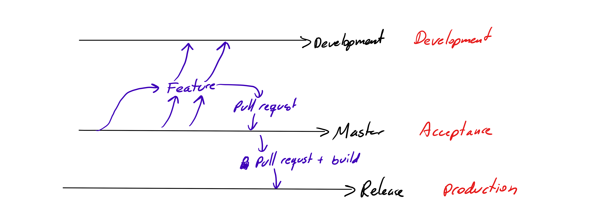

[Handbook](../../README.md) / Policies

# Branching

Some projects may have different branching strategies for historic or other reasons, but this document aims to explain the general strategy we use when developing.

---

The **master** branch contains all currently integrated features, this branch should be treated as a staging version, soon to go live into production.

All development, both PBIs and bugs are done in "feature" branches  created from the master branch as development on new features begin. 

When features are done, the "feature" branch is merged to the **master** branch following a code review. All code merged into **master** must go through a code review.

## development branch

The development branch is used in projects where the team shares a single environment for test and feedback. "Feature" branches can at any point, without code review, be merged to the **development** branch where the they can be tested if needed. The health state of the "development" branch is at any point unknown, and the developers are always responsible to clean after themselves and make sure to leave the branch in a good state.

## master branch

**Merging into master should only be done via Pull Requests** and go through a code review before getting merged.

All code in master is considered for the next production release.

If a project has a staging or pre-production environment, this is based on the **master** branch.

## feature branches

Feature branches are created as needed. Feature branches should be named **_"x-y"_** where
**x** is the PBI ID and **y** is the PBI/bug title. The title uses dashes instead of whitespace.

**Example**_: 2016-make-america-great-again_

Feature branches are not built and distributed. Instead can the feature be tested in the branch **development**.  Merging a feature branch into the development branch does not require a code review.

Note that the **development**  branch should <u>never</u> merged into **master** or back to the feature branches. Only feature branches are merged into **master**.

## release branch

The **release** branch contains everything that is currently live. In some projects it is also called **production**.

Only allowed way to get code into the release branch is through merging from the **master** branch.
